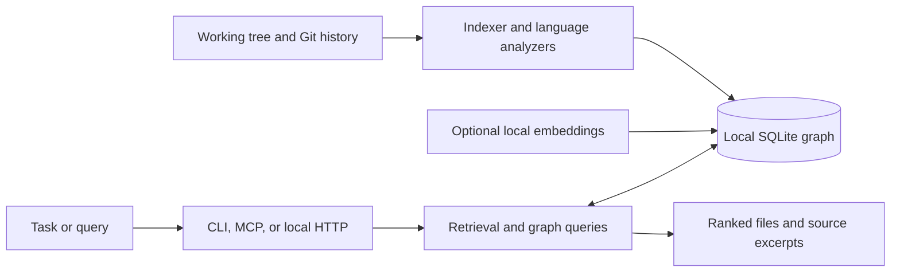

# agentRamen

[](https://github.com/palrajjp/agentRamen/actions/workflows/tests.yml)
[](https://www.python.org/)
[](LICENSE)
[](https://github.com/palrajjp/agentRamen/stargazers)

**A local map of your codebase, ready for the next coding task.**

*Persistent memory for your Git repo and AI coding agents.*

agentRamen indexes source structure and Git history into a local SQLite graph, then retrieves the files and excerpts most relevant to a task. Use it from the CLI, an MCP-compatible coding agent, or its local HTTP interface. No hosted service, API key, or runtime dependency is required by default.

## Quick start

Install agentRamen, then run it from the repository you want to explore:

```bash
python -m pip install agentramen
cd /path/to/your/repository
agentramen init
agentramen context "Add authentication" --budget 2000
agentramen impact src/auth.py
```

`agentramen init` creates the configuration, indexes the repository, and offers an optional GitHub Actions caller workflow. The index is stored locally in `.agentramen/graph.db`.

Try it in 30 seconds with [`examples/demo.sh`](examples/demo.sh). See the [roadmap](ROADMAP.md) and [contributing guide](CONTRIBUTING.md).

A minimal [VS Code extension](vscode-extension/README.md) is also available.

## What it can do

- **Find task context:** rank files using paths, symbols, imports, Git history, and optional local semantic similarity.
- **Explain change impact:** inspect dependencies, dependents, co-changes, hotspots, and file history.
- **Map repository structure:** explore architecture, export the graph, and query cached commit snapshots.
- **Connect to coding agents:** expose repository tools over MCP stdio, or use the local HTTP API and browser UI.
- **Keep data local:** index and optional embeddings stay in the repository's local database; source excerpts are read on demand.

## How it works



The default install uses the Python standard library and conservative analysis for other languages. Optional extras add Tree-sitter parsing, local semantic retrieval, and model-aware token counting.

## Install options

To install from a local checkout instead:

```bash
git clone https://github.com/palrajjp/agentRamen.git
cd agentRamen
python -m pip install .
```

Optional extras enable structured parsing for additional languages and local semantic retrieval:

agentRamen's default installation runs locally with no runtime dependencies. Python files use the standard-library AST; other supported extensions use conservative regex analysis unless the optional Tree-sitter extra is installed. Source excerpts are read on demand for context. When semantic retrieval is enabled, locally generated embeddings are also stored in `.agentramen/graph.db`; source and embeddings are not sent to a agentRamen service.

## Install

Requires Python 3.10+ and Git.

```bash
python -m pip install agentramen
cd /path/to/a/git/repository
agentramen init
agentramen context "Add authentication"
```

## Publishing releases

Configure a PyPI trusted publisher for `palrajjp/agentRamen`, using the
`.github/workflows/publish.yml` workflow and the `pypi` environment. To publish
a release, update the version in `pyproject.toml`, create a matching `v`-prefixed
Git tag, and publish a GitHub release for that tag. The workflow builds the
distributions and publishes them to PyPI using OIDC trusted publishing.

Optional extras enable structured parsing for additional languages and local semantic retrieval:

```bash
python -m pip install '.[treesitter]'
python -m pip install '.[semantic]'
python -m pip install '.[tokenizer]'
```

Semantic retrieval uses FastEmbed and may download/initialize its configured model on first use; embedding inference runs locally.

`agentramen init` creates `.agentramen.yml` and a GitHub Actions caller workflow if they do not exist, then creates/updates `.agentramen/graph.db`. `agentramen update` and `agentramen index` incrementally refresh changed files. The database is ignored by Git.

### Configuration

agentRamen reads the following fields from `.agentramen.yml`:

```yaml
version: 1
indexing:
  incremental: true
git:
  history: true
  co_changes: true
history:
  commits: 100
semantic:
  enabled: false
  model: BAAI/bge-small-en-v1.5
context:
  default_budget: 2000
  tokenizer_model: ""
ignore:
  - .env
  - "*.pem"
  - private/
```

`indexing.incremental: false` reparses every eligible file on each index. `git.history: false` removes stored commit, rename, and co-change history; enabling it later rebuilds the configured recent history. `history.commits` controls retained commits (1–100,000), and `git.co_changes` toggles co-change edges. `context.default_budget` is used by the CLI, MCP, and HTTP API when no budget is passed. Configuration is a dependency-free YAML subset; unsupported/malformed values are rejected with a setting-specific error. `.agentramenignore` patterns are added to, rather than replacing, the built-in and YAML ignore rules.

`semantic.enabled: true` opts into local embedding generation and semantic context ranking; install `agentramen[semantic]` first. `semantic.model` selects a FastEmbed model. `agentramen[treesitter]` opts into Tree-sitter-based parsing for supported non-Python languages; without it, or if a grammar is unavailable, agentRamen falls back to regex analysis.

`context.tokenizer_model` optionally selects a model supported by `tiktoken` for tokenizer-based context budgets; install `agentramen[tokenizer]` to use it. The tokenizer vocabulary may be downloaded and cached on first use, then counting runs locally. Leave it empty to use the dependency-free approximate character-based fallback. Context responses identify `token_count_method` (`tiktoken` or `approximate`) and the tokenizer model when configured. The reported total counts the compact serialized `files` payload (the retrieved context), using the same method as selection and budgeting; per-file counts are provided as `estimated_tokens`.

## Commands

```text
agentramen init
agentramen index [--json]
agentramen update [--json]
agentramen status [--json]
agentramen context "Add OAuth login" [--budget 2000] [--json]
agentramen impact src/auth/AuthService.ts [--json]
agentramen explain src/auth/AuthService.ts [--json]
agentramen history src/auth/AuthService.ts [--json]
agentramen search "auth login" [--limit 20] [--json]
agentramen architecture [--at <commit>] [--json]
agentramen hotspots [--limit 20] [--json]
agentramen changes [--limit 20] [--json]
agentramen diff <commit1> <commit2> [--json]
agentramen pr [--base origin/main] [--json]
agentramen export [--at <commit>] [--json]
agentramen benchmark --files 10 1000
agentramen serve [--host 127.0.0.1] [--port 8765]
agentramen mcp
```

Example context response:

```json
{
  "task": "Add authentication",
  "files": [
    {
      "path": "src/auth_service.py",
      "language": "python",
      "symbols": ["AuthService"],
      "imports": [],
      "recent_change": "add authentication",
      "estimated_tokens": 18
    }
  ],
  "token_budget": 2000,
  "files_avoided": 12,
  "confidence": "medium"
}
```

Context includes source excerpts only when the file still matches its indexed hash and does not contain a detected credential pattern. Token counts use the configured model tokenizer when available; otherwise they are approximate character-based estimates, not tokenizer measurements or performance claims.

## GitHub Actions

The workflow created by `agentramen init` calls the reusable workflow in this repository:

```yaml
name: agentRamen
on:
  push:
    branches: ["**"]
  pull_request:
  workflow_dispatch:
  schedule:
    - cron: "17 4 * * 1"
jobs:
  agentramen:
    uses: palrajjp/agentRamen/.github/workflows/index.yml@main
```

The reusable workflow fetches Git history, restores a cache, tests the installed package, indexes the checked-out revision, summarizes pull requests, and publishes the local SQLite artifact. Use a full-depth checkout when running the CLI outside this reusable workflow to retain history.

### Use from `gha-cd` or another workflow

Call the reusable workflow before a deployment or agent job. Supplying `task` also creates a bounded JSON context artifact; the workflow does not send repository content to an AI provider.

```yaml
jobs:
  agentramen:
    uses: palrajjp/agentRamen/.github/workflows/index.yml@main
    with:
      task: "Trace the deployment workflow and identify rollback dependencies"
      token_budget: 1200
```

The artifact is named `agentramen-context-${{ github.sha }}`. A downstream job can fetch it and pass `.agentramen-context/agentramen-context.json` to its agent step:

```yaml
- uses: actions/download-artifact@v4
  with:
    name: agentramen-context-${{ github.sha }}
    path: .agentramen-context
```

The context budget defaults to 2000 if omitted. Treat the artifact like source code: it can contain excerpts and follows the repository's GitHub Actions access and retention policy.

## Agent integrations

agentRamen's MCP server runs locally over stdio. Install agentRamen once on each developer machine, then add a portable `.mcp.json` at the repository root so VS Code Copilot and Claude Code can use the same configuration:

```bash
python -m pip install git+https://github.com/palrajjp/agentRamen.git
```

```json
{
  "mcpServers": {
    "agentramen": {
      "type": "stdio",
      "command": "agentramen",
      "args": ["mcp"]
    }
  }
}
```

For Claude Code, the project-scoped command creates or updates `.mcp.json`:

```bash
claude mcp add --transport stdio --scope project agentramen -- agentramen mcp
```

For GitHub Copilot CLI, save the same `mcpServers` object in `$COPILOT_HOME/mcp-config.json`, or `~/.copilot/mcp-config.json` when `COPILOT_HOME` is unset. See the [VS Code MCP configuration guide](https://code.visualstudio.com/docs/agent-customization/mcp-servers) and [Claude Code MCP guide](https://code.claude.com/docs/en/mcp) for client-specific setup and trust prompts.

In VS Code, trust the workspace and start the `agentramen` MCP server from the MCP Servers view. Each developer keeps an independent `.agentramen/graph.db`; commit `.agentramen.yml` and `.mcp.json` for shared settings, but do not put a live SQLite database on a network share.

### Keep agent context focused

Add an instruction like this to the project's `AGENTS.md`, `CLAUDE.md`, or Copilot instructions:

> For repository analysis, call `repo_context` with the current task before broad file reads. Start with a 1200-token budget, use the returned paths as the investigation boundary, then call `repo_explain` or `repo_impact` for targeted follow-up. Expand the search only when the indexed context is insufficient. Ask for `agentramen update` if the index appears stale.

The budget caps retrieved context, not the model's entire conversation. Counts use an approximate character-based estimate by default; install `agentramen[tokenizer]` and set `context.tokenizer_model` when model-specific counting is important. Run `agentramen update` to incrementally refresh a developer's local index after changes.

### ChatGPT and GPT Store

Custom GPTs cannot start a developer's local stdio process. A GPT Action or hosted ChatGPT app needs a reachable HTTPS service with authentication. `agentramen serve` binds to localhost and has no authentication, so do not expose it directly to the internet; a secure remote integration requires an authenticated gateway or a separately hosted MCP service. GPT creation and publishing availability depends on the current ChatGPT plan and workspace policy; see OpenAI's [GPT creation guide](https://help.openai.com/en/articles/8554397-creating-a-gpt).

## MCP

Run `agentramen mcp` from a repository and configure your MCP-compatible agent to launch that command in the repository working directory. Tools include `repo_context`, `repo_status`, `repo_history`, `repo_search`, `repo_explain`, `repo_impact`, `repo_dependencies`, `repo_tests`, `repo_changes`, `repo_architecture`, `repo_hotspots`, and `repo_graph`. The stdio server needs no API keys and does not access a network service.

## Local HTTP API

`agentramen serve` listens only on `127.0.0.1` by default. The browser UI is available at `/` and `/ui`. The API provides `GET /health`, `GET /api/v1/repository`, `/architecture`, `/graph`, `/files/{path}`, `/impact?path=...`, `/history?path=...`, `/hotspots`, and `POST /api/v1/context` or `/api/v1/search`. Append `?at=<commit>` to `/api/v1/graph` or `/api/v1/architecture` to query a cached, commit-addressable graph snapshot. POST requests accept JSON objects such as `{"task":"Add OAuth","token_budget":2000}`. No authentication is provided; do not bind to a public interface without placing an authenticated access-control layer in front.

## Benchmarking

Run `agentramen benchmark --files 10 1000` to measure synthetic initial indexing, a one-file incremental update, and context retrieval. Add `--repository /path/to/repo` to measure a temporary copy of a real repository's tracked working-tree files as well. Use `--semantic-mode both` to compare semantic retrieval off/on; the enabled run requires `agentramen[semantic]` and downloads its configured model if needed. If model setup is unavailable, the comparison reports that mode as an error and still returns measurements for the successful mode. Output includes lexical candidate count, database size, and retrieval/index timings. Results are local measurements, not cross-machine guarantees.

## Privacy and exclusions

The index stays in `.agentramen/graph.db` on the local machine or in the configured CI artifact. With semantic retrieval disabled, the database stores source metadata and hashes; when enabled, it additionally stores locally generated embeddings. agentRamen skips common generated directories, environment files, private-key files, oversized files, binary files, and files containing recognizable private-key or credential assignment patterns. Add more path patterns to `.agentramenignore` (one pattern per line). Review your ignore rules before publishing generated artifacts.

## Retrieval and memory

Context retrieval uses an incremental SQLite inverted index for lexical candidates, then fuses lexical, optional semantic, and graph/history rankings with reciprocal-rank fusion before applying the token budget. Reviewed memory can be staged, approved, or rejected; approving a new fact supersedes conflicting active facts with the same subject.

## Known limitations

- Import resolution handles common file and module layouts, but not every workspace alias or language-specific build system.
- Architecture and pull-request summaries use indexed dependency edges; they do not apply semantic boundary rules.
- Semantic retrieval calculates exact similarity rather than using an approximate-nearest-neighbor index.
- Token counts are approximate character-based estimates unless `context.tokenizer_model` is configured with the optional tokenizer extra.
- History keeps 100 commits by default, configurable from 1 to 100,000.

## Development

```bash
python -m unittest discover -s tests -v
python -m agentramen.cli status --json
```

If agentRamen is useful in your workflow, [a GitHub star](https://github.com/palrajjp/agentRamen/stargazers) helps other developers find it. Contributions that add language analyzers should keep parser-specific behavior separate from the indexing and context interfaces; see [CONTRIBUTING.md](CONTRIBUTING.md).
